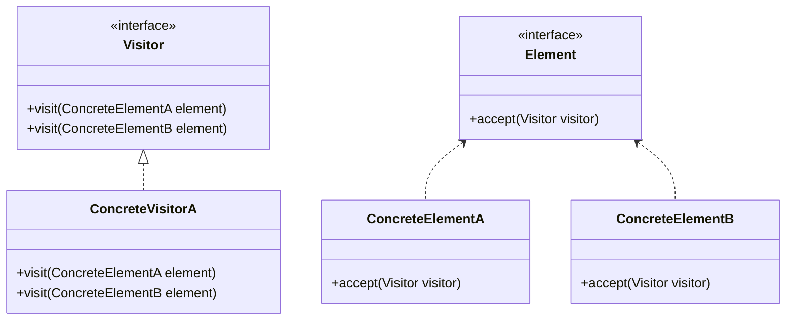
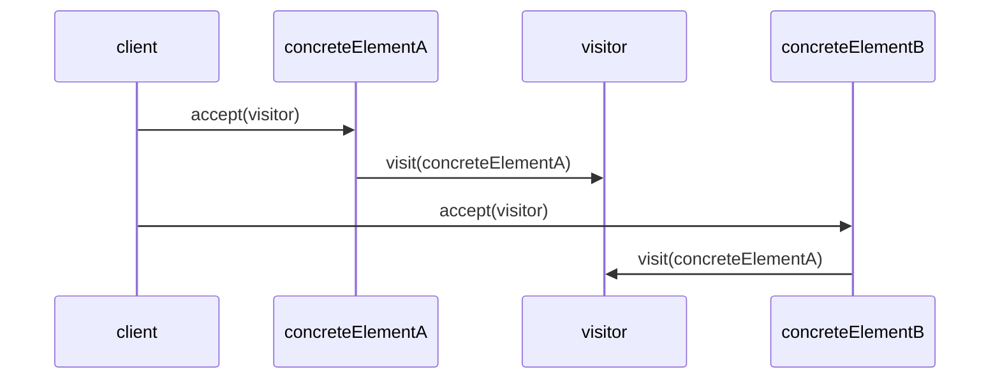

## Goals of this page

This page aims to demonstrate some examples of a page configuration and examples usage of some extensions.

## Emoji :smile:

* :grinning_face:
* :cold_face:
* :nerd_face:
* :rolling_on_the_floor_laughing:
* :broken_heart:
* :alien:

Some of the codes from this [Emoji Cheat Sheet](https://www.webfx.com/tools/emoji-cheat-sheet/) works.

## Admonition examples

!!! note

    note admonition example - not collapsible

??? info

    info admonition example - collapsible, not expanded by default

???+ tip

    tip admonition example - collapsible, expanded by default

!!! warning

    warning admonition example - not collapsible

???+ example

    example admonition example - collapsible, expanded by default

## Code blocks examples

```java title="frequencies-map-with-for.jsh"
/**
 * Run with JBang : jbang frequencies-map-with-for.jsh (1)
 * <p>
 * or open in JShell : /open frequencies-map-with-for.jsh
 */
import java.util.HashMap;
import java.util.List;
import java.util.Map;

List<String> daysOfWeek = List.of("Friday", "Thursday", "Thursday", "Saturday", "Thursday", "Thursday", "Monday", "Saturday", "Friday", "Saturday");
Map<String, Integer> frequencies = new HashMap<>();
int previousCount;
for (String day : daysOfWeek) {
    previousCount = frequencies.getOrDefault(day, 0);
    frequencies.put(day, previousCount + 1);
}

frequencies.entrySet().iterator().forEachRemaining(System.out::println);
```

1. :man_raising_hand: Code annotation example

## Tables examples

### Sortable table with no alignement specified for columns

| AtomicNumber | Symbol | Name      | AtomicMass  |
| ------------ | ------ | --------- | ----------- |
| 1            | H      | Hydrogen  | 1.0080      |
| 2            | He     | Helium    | 4.00260     |
| 3            | Li     | Lithium   | 7.0         |
| 4            | Be     | Beryllium | 9.012183    |

### Sortable table with columns aligned to left

| AtomicNumber | Symbol | Name      | AtomicMass  |
| :----------- | :----- | :-------- | :---------- |
| 1            | H      | Hydrogen  | 1.0080      |
| 2            | He     | Helium    | 4.00260     |
| 3            | Li     | Lithium   | 7.0         |
| 4            | Be     | Beryllium | 9.012183    |

### Sortable table with columns centered

| AtomicNumber | Symbol | Name      | AtomicMass  |
| :----------: | :----: | :-------: | :---------: |
| 1            | H      | Hydrogen  | 1.0080      |
| 2            | He     | Helium    | 4.00260     |
| 3            | Li     | Lithium   | 7.0         |
| 4            | Be     | Beryllium | 9.012183    |

### Sortable table with columns aligned to right

| AtomicNumber | Symbol | Name      | AtomicMass  |
| -----------: | -----: | --------: | ----------: |
| 1            | H      | Hydrogen  | 1.0080      |
| 2            | He     | Helium    | 4.00260     |
| 3            | Li     | Lithium   | 7.0         |
| 4            | Be     | Beryllium | 9.012183    |

## Diagrams with Mermaid examples

Hereafter an example with a class and a sequence diagram (inspired by the [Visitor Pattern](https://refactoring.guru/design-patterns/visitor)) but any diagram supported by [mermaid](https://mermaid.js.org/) is possible.




