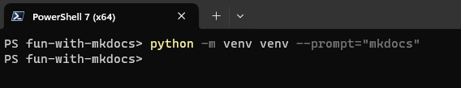
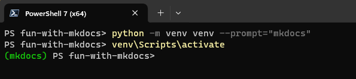
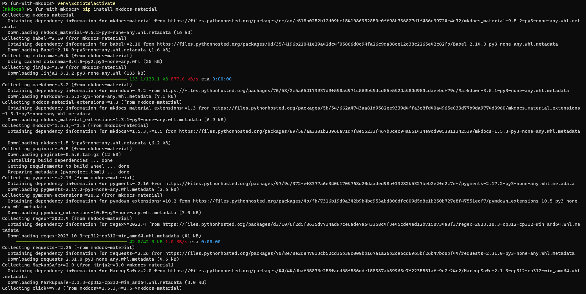
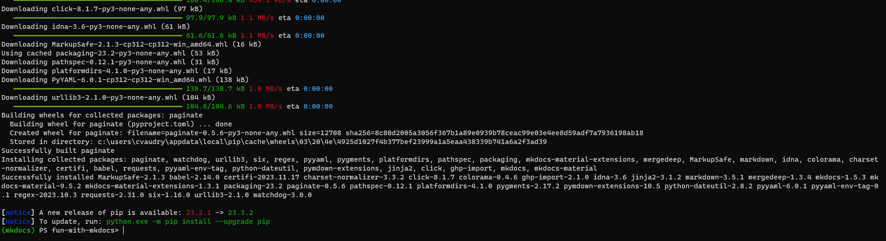
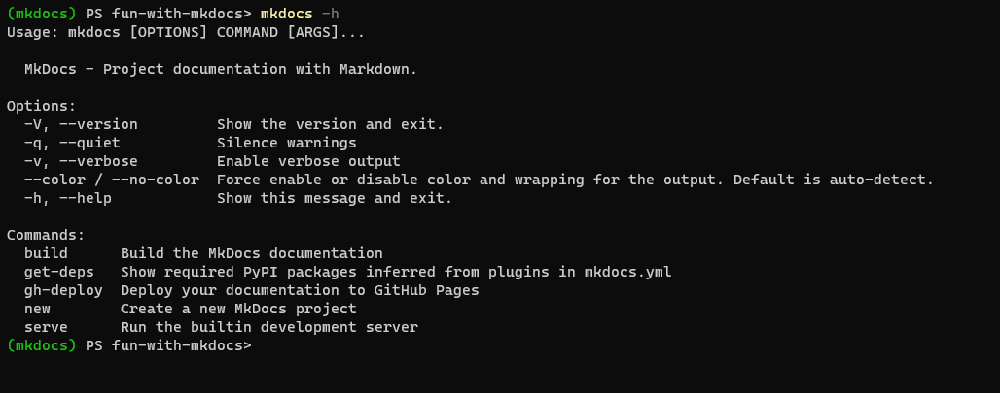
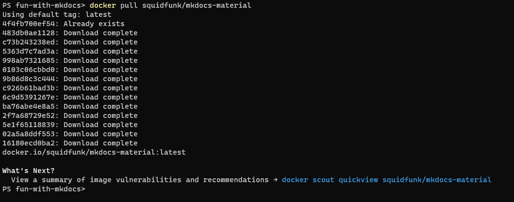

# Installing and running MkDocs

In the following example, I will use MkDocs with the theme Material.

The two main ways to install and run MkDocs that I will present are with Python and with Docker.

## Installing MkDocs with Python

MkDocs is a Python application. So the most obvious way to use it, is to install it via Python. 
It's a good option if you already have Python installed. 
If it is not the case and you do not want to install Python on your system only for MkDocs, we will see later another option using a container.

To install MkDocs (or in our case MkDocs with the material theme included) we will use pip. I also use a virtual environment it is recommended but not mandatory.

The following procedure supposes that you have Python installed and describes the installation with a virtual environment (venv is used here because it comes bundle with Python) for the ones who are not familiar with it. However you can install MkDocs without a virtual environment : the procedure will be the same (except for the part related to the virtual environment obviously) and MkDocs will be installed globally to your system.
Create the directory in which you want to put your documentation managed by MkDocs, open a shell and go to this directory. In my example the directory is named "fun-with-mkdocs".

Open a shell, and go to the root of this directory.
Then type the following to create a virtual environment :

```text
python -m venv venv --prompt="mkdocs"
```



A directory venv should have been created. If you use git and have a gitignore file you should add to it the directory venv.
Activate the virtual environment by typing :

```text
venv\Scripts\activate
```



Now we will install MkDocs and the material theme with pip by typing

```text
pip install mkdocs-material
```

Several components are installed, it takes some times and you should have something similar to the (partial) trace thereafter.





Congratulation, MkDocs should be installed. To confirm it, type `mkdocs -h`

The help of MkDocs should be displayed.



## Using a container

To be able to use this option, you must have Docker or Podman (on Windows I personally use Podman Desktop rather than Docker Desktop) installed and running on your system.

You can first pull the official Docker image (hereafter the official one for MkDocs with Material) by typing `docker pull squidfunk/mkdocs-material`.



If you successfully pull the image you should be able to run and use MkDocs. But more about that in the following section : if you are using a container to work with MkDocs, this is pretty much it for the installation part.
